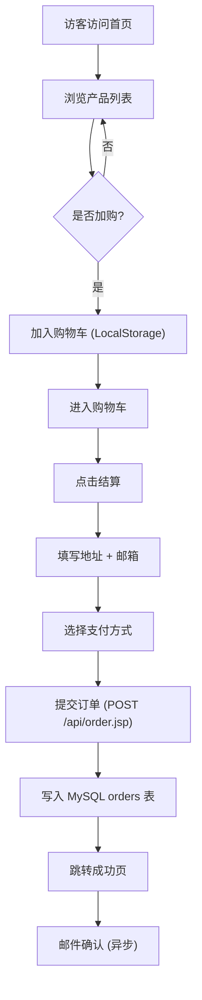

# PawPatrol · 宠物周边跨境电商独立站 产品需求文档（PRD）

> 项目代号：**PawPatrol Store**
> 部署目录：`/vol1/@appdata/1Panel/1panel/apps/tomcat/tomcat/data/webapps/store`
> 内网访问：`http://<host>:8866/store/`
> 域名访问：`https://www.apperload.com/store/`（已通过隧道将 8866 映射）
> 文档版本：v1.1 · 2026-06-25

---

## 1. 产品概述

PawPatrol Store 是一个面向全球宠物主人的跨境电商独立站，主营宠物周边产品（服饰、玩具、窝床、餐具、出行装备、智能硬件等）。项目以"温暖、有设计感、可信赖"为基调，通过高质量视觉与顺畅购物体验占领中高端宠物周边市场。

- **核心问题**：跨境用户缺乏一个能"一站式购齐宠物生活美学单品"的独立站。
- **目标用户**：养猫/养狗/异宠的 22–45 岁中产家庭，注重设计、品质、可持续。
- **市场价值**：建立品牌私域，降低对 Amazon / Etsy 平台依赖，复购率更高。

## 2. 核心功能

### 2.1 用户角色
| 角色 | 注册方式 | 核心权限 |
|------|----------|----------|
| 访客（Guest） | 无需注册 | 浏览首页、产品列表、详情、加购、订阅邮件 |
| 顾客（Customer） | 邮箱 / 第三方登录 | 全部访客权限 + 下单、收藏、查看订单、地址簿、积分 |
| 管理员（Admin） | 后台录入 | 商品上下架、库存、订单处理、内容管理 |

### 2.2 功能模块
1. **首页**：品牌叙事 Hero、分类入口、热门商品、宠物故事、合作品牌、邮件订阅。
2. **产品列表页**：分类筛选、价格区间、宠物类型筛选（猫/狗/小宠）、排序、分页。
3. **产品详情页**：高清图集、规格参数、用户评价、推荐搭配、加购 / 立即购买。
4. **购物车**：多商品合并、加减数量、删除、运费估算、推荐凑单。
5. **结算页**：地址簿、支付方式（Stripe / PayPal / Apple Pay 占位）、订单备注。
6. **关于我们**：品牌故事、可持续发展承诺、团队介绍。
7. **联系我们**：常见问题、客服表单、社交媒体入口。
8. **搜索结果页**：关键词搜索、结果筛选与排序。
9. **404 / 错误页**：友好引导与返回首页。

### 2.3 页面详细说明
| 页面 | 模块 | 功能描述 |
|------|------|----------|
| 首页 | Hero 区 | 全屏视频/大图 + 主标题"为爱宠挑选每一份心意" + CTA |
| 首页 | 分类入口 | 6 个圆形品类卡（猫窝、狗绳、玩具、食盆、出行、智能） |
| 首页 | 热门商品 | 8 张商品卡，悬停切换第二张图，加购按钮 |
| 首页 | 宠物故事 | 横向滚动图文卡，展示真实用户故事 |
| 首页 | 邮件订阅 | 输入邮箱、提交后端 JSP 写入订阅表 |
| 产品列表 | 筛选侧栏 | 分类、价格、宠物类型、颜色、材质多维度筛选 |
| 产品列表 | 排序 | 价格升降序、热度、上新 |
| 产品详情 | 图集 | 5+ 张图，主图 + 缩略图，鼠标悬停切换 |
| 产品详情 | 规格 | 颜色 / 尺寸 / 材质 / 适用体重 |
| 产品详情 | 评价 | 评分、买家秀、按图筛选 |
| 购物车 | 商品行 | 图片、标题、规格、单/小计、删除 |
| 购物车 | 运费估算 | 根据国家与重量返回估算（前端 mock） |
| 结算 | 地址 | 收件人、电话、国家、邮编、详细地址 |
| 结算 | 支付 | 信用卡、PayPal、Apple Pay、Klarna 占位 |
| 关于我们 | 品牌故事 | 3 段叙事 + 团队照片墙 |
| 联系我们 | 表单 | 姓名、邮箱、主题、留言 |

## 3. 核心流程

### 3.1 访客购物流程
访客进入首页 → 浏览分类 → 查看商品详情 → 加入购物车（写入 LocalStorage） → 进入购物车 → 填写邮箱 + 地址（结算页） → 选择支付方式 → 提交订单（JSP 写入 MySQL `orders` 表） → 跳转成功页。

### 3.2 Mermaid 流程图

### 3.3 管理员流程
管理员登录 → 后台管理 → 商品管理 / 订单管理 / 用户管理。

## 4. 用户界面设计

### 4.1 设计风格
- **主色**：`#F4A261` 暖橘（爱宠温度感）
- **辅色**：`#2A9D8F` 草绿（自然清新） · `#264653` 深石板灰（高级感文字）
- **中性色**：`#FAF7F2` 米白底 · `#1B1B1B` 文字黑
- **强调色**：`#E76F51` 珊瑚红（CTA / 促销标签）
- **圆角**：12px 卡片、24px 按钮、999px 胶囊标签
- **字体**：
  - 标题：`Fraunces`（衬线、温暖）+ `Outfit`（无衬线、几何感）回退 `Noto Serif SC` / `PingFang SC`
  - 正文：`Outfit` 400/500
- **按钮**：实心 24px 圆角 + 悬浮投影；图标按钮 40×40 圆环
- **布局**：顶部固定导航 + 主区 1280px 居中 + 底部 4 列
- **图标**：Lucide（CDN ESM）
- **动效**：进入动画（淡入 + 上移 8px，stagger 80ms）、悬停图切换、滚动视差

### 4.2 页面设计概览
| 页面 | 模块 | UI 元素 |
|------|------|----------|
| 首页 | Hero | 全屏渐变背景 + 浮动 paw 装饰 + 大标题 + 双 CTA |
| 首页 | 分类入口 | 6 圆形卡片，悬停旋转 5° 并加阴影 |
| 产品卡 | 卡片 | 1:1 图片、悬停切换第二图、底部加购胶囊 |
| 详情页 | 图集 | 左侧主图 80%，右侧缩略图纵列，sticky |
| 购物车 | 表格 | 桌面端表格 / 移动端卡片 |
| 结算 | 表单 | 2 列布局，step indicator 三步 |

### 4.3 响应式
桌面优先（1280+），断点 `md 768` / `lg 1024` / `xl 1280`。
移动端：汉堡菜单 → 全屏抽屉；商品列表 2 列；结算页单列纵向。

### 4.4 3D 场景指导（可选增强）
- 不强制使用 3D；如需在 Hero 中加入旋转的 3D 宠物 IP，可使用 Spline 嵌入。
- 推荐 HSR：`studio_small_03_4k.hdr`（暖色）
- 主光：方向光 `#FFE0B5`，强度 1.2
- 相机：透视 35mm，缓慢绕 Y 轴 0.1 rad/s
- 后期：Bloom 0.3 + Grain 0.05

## 5. 国际化与多币种
- 默认语言：英语（en-US），可扩展 zh-CN / ja-JP。
- 默认币种：USD，可在购物车切换 EUR / GBP / JPY / CNY。
- 货币切换通过前端 Intl.NumberFormat，不与后端强绑定。

## 6. 性能与可访问性
- 首屏 LCP < 2.5s（图片 `loading="lazy"` + 响应式 `srcset`）。
- 主要交互元素 `aria-label` / `role` 完备。
- 颜色对比度 ≥ 4.5:1。

## 7. 上线检查清单
- [ ] 8 个核心页面全部实现
- [ ] 商品数据通过 JSP 从 MySQL 加载
- [ ] 购物车 LocalStorage 持久化
- [ ] 移动端断点 320 / 768 / 1024 验证
- [ ] 浏览器 Lighthouse 性能 ≥ 85
- [ ] SEO meta + OG 图
