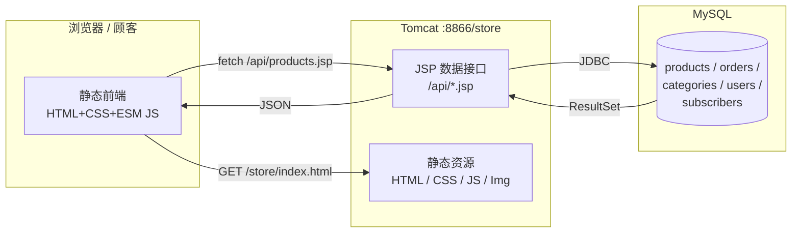
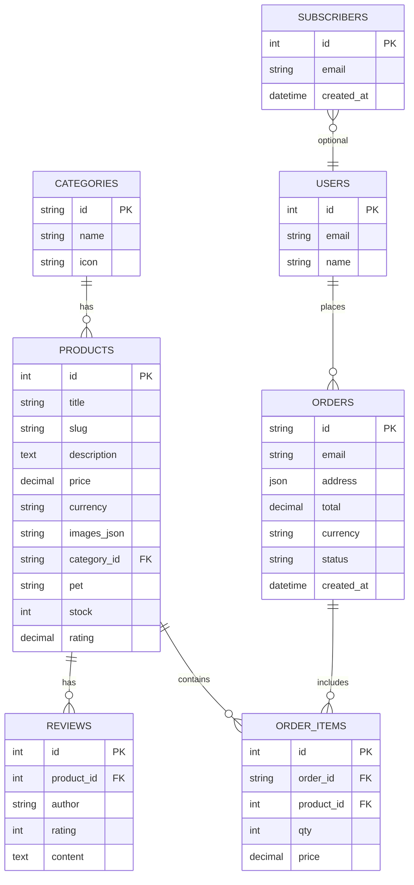

# PawPatrol Store · 技术架构文档

> 部署目录：`/vol1/@appdata/1Panel/1panel/apps/tomcat/tomcat/data/webapps/store`
> Tomcat 端口：8866 · Web 服务器：Apache Tomcat (Docker)
> 内网访问：`http://<host>:8866/store/`
> 域名访问：`https://www.apperload.com/store/`（已通过隧道映射 8866 端口）
> 数据库：MySQL（同机 Docker 容器）
> 文档版本：v1.1 · 2026-06-25

---

## 1. 架构设计



整体采用 **前后端半分离** 模式：前端用纯 HTML/CSS/ES Module JS（无构建步骤），后端用 JSP 直接输出 JSON，前端通过 `fetch` 调用 `*.jsp` 接口读写 MySQL。

## 2. 技术选型

| 维度 | 选型 | 理由 |
|------|------|------|
| 前端 | 原生 HTML5 + ES Module + CSS3 变量 | 零构建、部署简单、可直接放 Tomcat webapps |
| 字体 | Google Fonts (Fraunces / Outfit) | 设计感强、CDN 加载快 |
| 图标 | Lucide (ESM CDN) | 风格统一、矢量、可换色 |
| 后端 | JSP + JDBC | 与现有 Tomcat 环境一致；用户已熟悉 |
| 数据库 | MySQL 8.x | 用户已配；商品/订单结构化强 |
| 连接池 | Tomcat JDBC Pool (`<Resource>`) | 复用现有 Tomcat 配置即可 |
| 国际化 | Intl API | 浏览器原生支持多币种/多语言 |
| 状态 | LocalStorage（购物车、收藏） | 无后端依赖、跨页保留 |

> **不引入**：React / Vue / Vite / Webpack（保持零构建，便于 Tomcat 直接部署）。

## 3. 目录结构

```
store/
├── .trae/documents/         # PRD + 技术架构文档
├── WEB-INF/
│   ├── web.xml              # Servlet / JSP / 数据源配置
│   ├── classes/db.properties # 数据库连接信息（不提交敏感信息）
│   └── lib/                 # 预留：MySQL JDBC 驱动由 Tomcat 提供
├── api/                     # JSP 后端接口（输出 JSON）
│   ├── products.jsp         # GET 商品列表 / 详情
│   ├── categories.jsp       # GET 分类
│   ├── subscribe.jsp        # POST 邮件订阅
│   └── order.jsp            # POST 提交订单
├── assets/
│   ├── css/
│   │   ├── base.css         # 重置 + 变量
│   │   ├── layout.css       # 通用布局
│   │   ├── components.css   # 按钮 / 卡片 / 表单
│   │   └── pages.css        # 各页面专属样式
│   ├── js/
│   │   ├── main.js          # 入口（路由 + 公共）
│   │   ├── data.js          # mock 数据 + API 封装
│   │   ├── cart.js          # 购物车 LocalStorage
│   │   ├── ui.js            # 抽屉、Toast、模态
│   │   └── pages/
│   │       ├── home.js
│   │       ├── list.js
│   │       ├── detail.js
│   │       ├── cart.js
│   │       ├── checkout.js
│   │       ├── about.js
│   │       └── contact.js
│   ├── img/                 # 静态图（占位用 Unsplash 远程 + 后续替换）
│   └── icon/                # favicon / og 图
├── index.html               # 首页
├── products.html            # 产品列表
├── product.html             # 产品详情（?id=xxx）
├── cart.html                # 购物车
├── checkout.html            # 结算
├── about.html               # 关于我们
├── contact.html             # 联系我们
├── 404.html                 # 错误页
└── README.md                # 部署说明
```

## 4. 路由定义

| 路径 | 文件 | 说明 |
|------|------|------|
| `/store/` | `index.html` | 首页 |
| `/store/products.html` | `products.html` | 产品列表，支持 `?category=&pet=` |
| `/store/product.html` | `product.html` | 详情页，`?id=` 必填 |
| `/store/cart.html` | `cart.html` | 购物车 |
| `/store/checkout.html` | `checkout.html` | 结算 |
| `/store/about.html` | `about.html` | 关于我们 |
| `/store/contact.html` | `contact.html` | 联系我们 |
| `/store/api/products.jsp` | JSP | 商品 JSON |
| `/store/api/order.jsp` | JSP | 订单提交 |

> 客户端不使用 hash 路由，直接走真实 URL，利于 SEO。

## 5. API 定义

### 5.1 `GET /store/api/products.jsp`
**Query**：`category=string?`、`pet=cat|dog|small?`、`page=number?`、`size=number?`

**Response**：
```json
{
  "code": 0,
  "data": {
    "total": 42,
    "items": [
      {
        "id": 1,
        "title": "Cozy Cloud Cat Bed",
        "slug": "cozy-cloud-cat-bed",
        "price": 49.0,
        "currency": "USD",
        "images": ["/store/assets/img/p1-1.jpg"],
        "category": "bed",
        "pet": "cat",
        "rating": 4.8,
        "stock": 23
      }
    ]
  }
}
```

### 5.2 `GET /store/api/products.jsp?id=1`
**Response**：
```json
{
  "code": 0,
  "data": { "id": 1, "title": "...", "description": "...",
             "specs": [{"k":"Material","v":"Recycled plush"}],
             "images": [...], "price": 49.0, "stock": 23,
             "rating": 4.8, "reviews": [ ... ] }
}
```

### 5.3 `GET /store/api/categories.jsp`
**Response**：
```json
{ "code":0, "data":[
  { "id":"bed", "name":"Beds & Caves", "icon":"bed" },
  { "id":"toy", "name":"Toys", "icon":"toy" } ] }
```

### 5.4 `POST /store/api/subscribe.jsp`
**Body**：`{ "email": "a@b.com" }`
**Response**：`{ "code":0, "msg":"subscribed" }`

### 5.5 `POST /store/api/order.jsp`
**Body**：
```json
{
  "email": "user@example.com",
  "items": [{ "id":1, "qty":2, "price":49.0 }],
  "address": { "name":"...","country":"US","zip":"...","line1":"..." },
  "total": 98.0,
  "currency": "USD"
}
```
**Response**：`{ "code":0, "orderId":"PP202606250001" }`

## 6. 数据模型

### 6.1 ER 图


### 6.2 建表 SQL（迁移文件 `migrations/001_init.sql`）
```sql
CREATE TABLE categories (
  id VARCHAR(32) PRIMARY KEY,
  name VARCHAR(64) NOT NULL,
  icon VARCHAR(32)
) ENGINE=InnoDB DEFAULT CHARSET=utf8mb4;

CREATE TABLE products (
  id INT AUTO_INCREMENT PRIMARY KEY,
  title VARCHAR(255) NOT NULL,
  slug VARCHAR(255) UNIQUE,
  description TEXT,
  price DECIMAL(10,2) NOT NULL,
  currency CHAR(3) DEFAULT 'USD',
  images_json JSON,
  category_id VARCHAR(32),
  pet ENUM('cat','dog','small','all') DEFAULT 'all',
  stock INT DEFAULT 0,
  rating DECIMAL(3,2) DEFAULT 5.00,
  created_at DATETIME DEFAULT CURRENT_TIMESTAMP,
  FOREIGN KEY (category_id) REFERENCES categories(id)
) ENGINE=InnoDB DEFAULT CHARSET=utf8mb4;

CREATE TABLE orders (
  id VARCHAR(32) PRIMARY KEY,
  email VARCHAR(128) NOT NULL,
  address_json JSON,
  total DECIMAL(10,2),
  currency CHAR(3) DEFAULT 'USD',
  status ENUM('pending','paid','shipped','done','refund') DEFAULT 'pending',
  created_at DATETIME DEFAULT CURRENT_TIMESTAMP
) ENGINE=InnoDB DEFAULT CHARSET=utf8mb4;

CREATE TABLE order_items (
  id INT AUTO_INCREMENT PRIMARY KEY,
  order_id VARCHAR(32),
  product_id INT,
  qty INT,
  price DECIMAL(10,2),
  FOREIGN KEY (order_id) REFERENCES orders(id),
  FOREIGN KEY (product_id) REFERENCES products(id)
) ENGINE=InnoDB DEFAULT CHARSET=utf8mb4;

CREATE TABLE reviews (
  id INT AUTO_INCREMENT PRIMARY KEY,
  product_id INT,
  author VARCHAR(64),
  rating INT,
  content TEXT,
  created_at DATETIME DEFAULT CURRENT_TIMESTAMP
) ENGINE=InnoDB DEFAULT CHARSET=utf8mb4;

CREATE TABLE subscribers (
  id INT AUTO_INCREMENT PRIMARY KEY,
  email VARCHAR(128) UNIQUE,
  created_at DATETIME DEFAULT CURRENT_TIMESTAMP
) ENGINE=InnoDB DEFAULT CHARSET=utf8mb4;
```

### 6.3 初始数据（`migrations/002_seed.sql`）
- 6 个分类：bed / toy / apparel / bowl / travel / smart
- 8~12 个商品（标题、价格、图片、规格）
- 4 条评价

## 7. 服务端架构

```
JSP /api/*.jsp
  └─ set contentType="application/json;charset=UTF-8"
  └─ db = new DbUtil()
  └─ query: DbUtil.list(sql, params) → List<Map>
  └─ out.print(JSON.toJson(result))
```

`DbUtil` 读取 `WEB-INF/classes/db.properties`，使用 `DriverManager`（简化） 或 `javax.sql.DataSource` 注入（推荐）。

## 8. 部署步骤

1. 把 `store/` 目录复制到 Tomcat 的 `webapps/` 下。
2. 在 MySQL 中执行 `migrations/001_init.sql` 与 `002_seed.sql`。
3. 修改 `WEB-INF/classes/db.properties` 填入实际库信息。
4. 重启 Tomcat（或热部署 `autoDeploy=true`）。
5. 浏览器访问 `https://www.apperload.com/store/`（生产域名）或 `http://<host>:8866/store/`（内网直连）。

## 9. 后续扩展
- 引入 Stripe / PayPal 真实支付
- 增加管理后台（独立 `/admin/` 目录）
- 增加博客 / 宠物护理指南
- 接入 CDN + 服务端图片压缩
- 引入 Algolia 实现全文搜索
